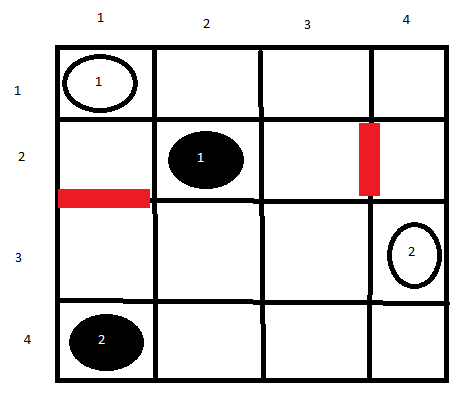

\mainpage Table Game - Task Description

\section solution Решение игры

Пусть есть доска N х N. Доска разбита на клетки 1х1. В каждой клетке может находит или шарик или дырка или ни чего не находиться. Между клетками могут быть стенки как вертикально, так и горизонтально. По периметру доски стена сплошная.
Число шариков на доске равно числу дырок и равно K, число стенок равно M. Все дырки и шарики пронумерованы с 1 до K.

На вход программы подаётся файл с числами:

    N K M BX1 BY1 BX2 BY2 .. BXK BYK HX1 HY1 .. HXK HYK WL1 WT1 WR1 WB1 … WLM WTM WRM WBM

Где:

    N – размерность доски
    K – количество шариков, равно количеству дырок
    BX1 BY1 – координата первого шарика (координаты от 1 до N)
    BX2 BY2 – координата второго шарика
    BXK BYK – координата последнего шарика
    HX1 HY1 – координата первой дырки (координаты от 1 до N)
    HXK HYK – координата последней дырки
    WL1 WT1 WR1 WB1 – координаты первой стенки. Стенка задаётся через указание двух клеток «WL1 WT1» - первая клетка и «WR1 WB1» - вторая клетка. Стенка стоит между ними.
    WLM WTM WRM WBM – координаты последней стенки.

Стенка по периметру не описывается в этом файле: она всегда есть.

Например такая доска:

Будет описана так:

    4 2 2 2 2 1 4 1 1 4 3 1 2 1 3 3 2 4 2

\section  rules Правила игры

Доску можно наклонять:
* W – на запад, в этом случае шарики катятся влево,
* S – на юг, в этом случае шарики катятся вниз,
* E – на восток, в этом случае шарики катятся вправо,
* N – на север, в этом случае шарики катятся вверх,

Шарики катятся до первого препятствия: стенки, дырки или другого шарика. Если шарик попадает в дырку, то сравнивается номер дырки и шарика, если они не совпадают то игра проиграна, если совпадают, то дырка считается закрытой и туда шарик упасть больше не может.

Цель игры: загнать все шарики в соответствующие дырки.

\section aim Цель тестовой программы

На основании заданной начальной конфигурации игры, найти, за минимальное время, минимальную последовательность шагов в игре чтобы все шарики оказались в соответствующих дырках и распечатать это на консоль.

Если решений одной длины несколько, надо выдать их все, через символ перевода строки.

Для показанного примера программа должна выдать:
    NEW
    ENW
    WNE

\section estimation Оценка качества
* Алгоритм решения задачи,
* Оформление кода,
* «Защита от дурака»
* Скорость работы,
* Потребляемая память
